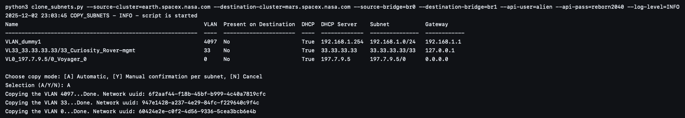

**Project**

Clone Subnets

This repository contains a small utility to copy VLAN-backed subnets from one Nutanix cluster/bridge to another using the Prism API v2.

**Requirements**

- **Python**: 3.8+
- **Dependencies**: install with `pip install -r requirements.txt`

**Usage**

  `python clone_subnets.py -s SOURCE_CLUSTER -d DEST_CLUSTER -v SOURCE_BRIDGE -x DEST_BRIDGE -u API_USER -p API_PASS --log-level LEVEL`

  - **-s / --source-cluster**: source cluster address
  - **-d / --destination-cluster**: destination cluster address
  - **-v / --source-bridge**: source virtual switch name
  - **-x / --destination-bridge**: destination virtual switch name
  - **-u / --api-user**: API username
  - **-p / --api-pass**: API password
  - **--log-level**: logging level (e.g., INFO, DEBUG)

**Screenshot**

**Behavior**

- The script connects to both clusters via APIv2 and retrieves the configured networks.
- The script connects to both clusters via APIv2 and retrieves the configured networks. It supports copying between bridges that reside on different clusters — the tool queries each cluster independently and compares destination state before creating subnets.
- It prints a table of subnets found on the source bridge with these columns: **Name**, **VLAN**, **Present on Destination**, **DHCP**, **DHCP Server**, **Subnet**, **Gateway**.
- After showing the table the script asks for a copy mode:
  - **A**: Automatic — copy all missing subnets to the destination
  - **Y**: Manual — ask before copying each subnet (Y = copy, N = skip)
  - **N**: Cancel — abort the operation
- When copying, the tool calls the API to create the subnet on the destination cluster; created network UUIDs are printed on success.

**Implementation notes**

- Subnet creation logic and request body generation live in [util/helpers.py](util/helpers.py).
- Argument parsing is implemented in [util/arguments.py](util/arguments.py).
- The main script is [clone_subnets.py](clone_subnets.py).
- The script compares subnets against the destination cluster's networks (not the source list) to determine whether a VLAN already exists.

**Interactive input**

- The script currently uses interactive prompts for the A/Y/N confirmation and per-subnet confirmations in manual mode. There is an open enhancement to read single-key responses (no Enter) on supported platforms.

**Safety & idempotency**

- The script will not attempt to recreate VLANs already present on the destination bridge.
- Review the table output carefully before confirming copies, especially in automatic mode.

**Troubleshooting**

- If API calls fail, check network reachability and credentials. The REST calls use HTTPS to the cluster API endpoint on port 9440.
- Use `--log-level DEBUG` to see more details.

**License & Author**

Author: Casian Merce

**Disclaimer**

This software is provided "as is" and without warranties of any kind, whether express or implied, including but not limited to merchantability, fitness for a particular purpose, or non-infringement. The author expressly disclaims all liability for any direct, indirect, incidental, special, consequential, or punitive damages, or any loss of profits, data, systems, or other intangible losses arising out of the use of or inability to use this software, even if the author has been advised of the possibility of such damages.

You are solely responsible for the decision to use, modify, deploy, or operate this script. It is your responsibility to verify the script's behavior, test it in safe/non-production environments, ensure it meets your security and compliance requirements, and to obtain any necessary approvals before running it against production systems. Any consequences resulting from your use or misuse of the script are your responsibility alone.

By using this software you acknowledge that you have read, understood, and accepted this disclaimer.
# clone-subnets
